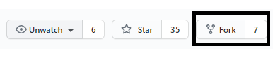
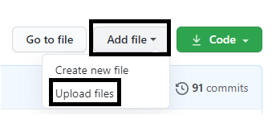
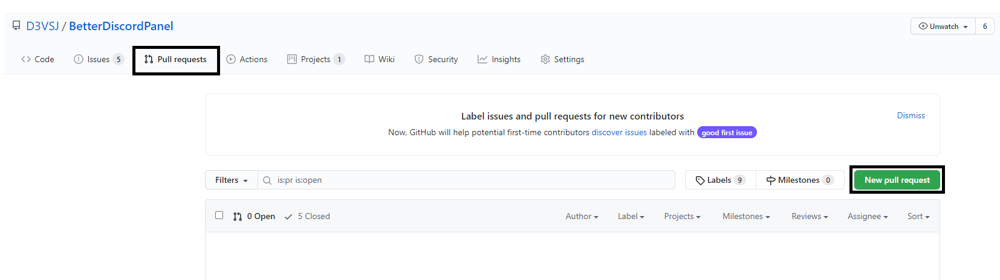
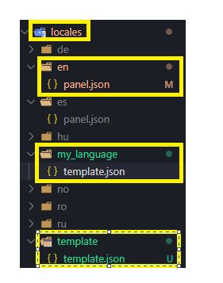
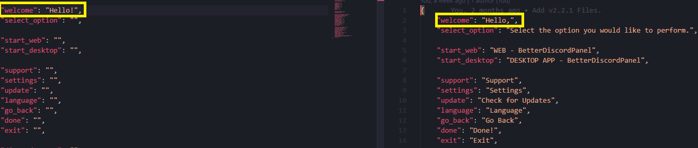

# How to translate BetterDiscordPanel

### Fork the Repository



## BetterDiscordPanel

### 1. Open the translation file [locales.js](https://github.com/SanjaySunil/BetterDiscordPanel/blob/master/assets/js/locales.js)
Open the `locales.js` file containing all the translations of the panel.

### 2. Translate
Copy this into the translation file, and start translating.

```js
langCode: {
		langCode: "en",
		language: "English",
		// ========================= PANEL =========================
		status: {
			loading: "Loading ...",
		},
		headings: {
			profile: "Discord Bot",
			guildName: "Chats",
			settings: "Settings"
		},
		"sub-headings": {
			about: "About",
			tools: "Tools",
			info: "Info",
		},
		navbar: {
			profileNav: "Profile",
			chatNav: "Chat",
			lastMessagesNav: "Last Messages",
			infoNav: "Chat / Server Info",
			settingsNav: "Settings",
			lightDark: "Light / Dark Mode",
			logoutTitle: "Logout",
		},
		text: {
			channelNameLabel: "Chat",
			fileSent: "sent some file(s)",
			attachmentTxt: "Attachments",
			privateMessages: "DM",
			profileSection: {
				name: "Name",
				discrim: "Discrim",
				id: "ID",
				guilds: "Guilds",
				createdAt: "Created At"
			},
			settingsSection: {
				createBotInvite: "Create Bot Invite",
				eval: "EVAL",
				languages: "Languages",
			},
		},
		buttons: {
			clearLastMessages: "Clear Last Messages",
			editToken: "Logout",
			refreshChat: "Refresh chat",
			send: "Send",
			leave: "Leave server",
			invite: "Invite",
		},
		// ========================= DISCORD =========================
		infos: {
			owner: "Owner",
			members: "Members",
			vChannels: "Channels (voice)",
			tChannels: "Channels (text)",
			roles: "Roles",
			channels: "Channels",
			emojis: "Emojis",
		},
		errors: {
			error: "ERROR",
			dm: "ERROR : DM",
			emptyMsg: "Empty Message!",
			missingPermissions: "Missing Permissions!",
		},
		token: {
			confirmation: "Are you sure you want to logout?",
			invalid: "Token is Invalid. Please try again.",
		},
		messageType: {
			serverJoin: "joined the server.",
			pin: "pinned a message.",
			channelNews: "added a remote channel news.",
			boost: "boosted the server.",
		},
		fileType: {
			unknown: "unknown",
			img: "image",
			doc: "document",
			pdf: "pdf",
			video: "video",
			audio: "audio",
		},
	},
```

### 3. Upload Changes



### 4. Make a pull request



## Control Panel (BetterDiscordPanel.cmd)

### 1. Add your language
Create a new folder in the `locales` directory and copy the template.json file.



### 2. Translate
Use the English Translation file to help you translate the phrases required for the language.



### 3. Upload Changes


### 4. Make a pull request


***

#### If you encounter any problems, please create a new issue.
