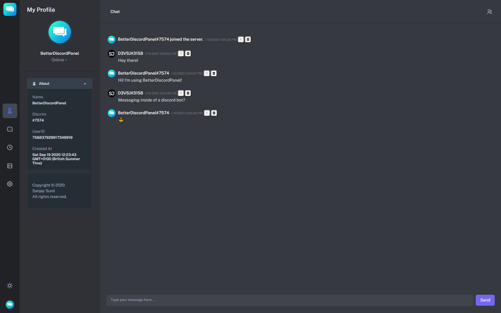

<!-- Logo -->
<p align="center">
  <a href="https://github.com/sanjaysunil/betterdiscordpanel">
    
  </a>
</p>

<!-- Title -->
<h1 align="center">BetterDiscordPanel</h1>
  <p align="center">
    Discord Messaging Panel that allows you to message inside of a bot!
    <br />
    <br />
    <a href="https://github.com/SanjaySunil/BetterDiscordPanel/issues/new?assignees=&labels=Bug&template=bug_report.md&title=%5BBUG%5D">Report Bug</a>
    ·
    <a href="https://github.com/SanjaySunil/BetterDiscordPanel/issues/new?assignees=&labels=Suggestions&template=suggestions.md&title=%5BSUGGESTION%5D">Request Feature</a>
  </p>
</h1>
<br/><br/>

<!-- Preview -->
<p align="center">
  <a href="">
    
  </a>
  <!-- Drop Shadow -->
  <a href="">
    
  </a>
</p>
<br/>

<!-- Information -->

## What's BetterDiscordPanel?

<a href="https://github.com/betterdiscordpanel" target="_blank">BetterDiscordPanel</a> is a new panel that allows you to message, manage and gain statistics inside of your discord bot.
<br/>

<!-- Features -->

## ✨ Features

- 📊 **Discord Bot Statistics:** Gain full insights and details of your discord bot with server and bot information.
- 💬 **Simple Messaging Interface:** BetterDiscordPanel allows you to easily message users and chat within servers using your discord bot. The panel also has a light and dark theme to suit your needs!
- 🔒 **Security:** BetterDiscordPanel does not run on any servers and can be self hosted. All bot details are stored locally and is completely secure.
- 👀 **Opensource:** BetterDiscordPanel is open source on GitHub so you can see all the code behind the project.

<br/>

<!-- Getting Started -->

## 🛠 Getting Started

Simply open `index.html` to open the web version of BetterDiscordPanel or use the control panel to open the desktop application by running `BetterDiscordPanel.cmd`.
<br/>

<!-- Installation -->

### **Step 1:** Prerequisites
To use the **desktop application** of BetterDiscordPanel, you will need to have the following installed.

- Node.js
- npm

[Instructions](https://docs.npmjs.com/downloading-and-installing-node-js-and-npm)

> ⚠️ **NOTE**: To use the **web version** of BetterDiscordPanel, you will need to set a custom User Agent.

[Setting a custom User Agent](./docs/prerequisites/prerequisites.md)
### **Step 2:** Setup / Installation

1. Clone the repository

```sh
git clone https://github.com/sanjaysunil/betterdiscordpanel
```

> ⚠️ **NOTE**: The updater only works if you have cloned the repository. 

2. Open `login.html` for the web application or open `BetterDiscordPanel.cmd` to run the desktop application.

3. Login to your discord bot using your discord bot token.

4. Start using BetterDiscordPanel!
<br/>

<!-- ROADMAP -->

## Roadmap

See the [open issues](https://github.com/sanjaysunil/betterdiscordpanel/issues) for a list of proposed features (and known issues).
<br/>

<!-- CONTRIBUTING -->

## Contributing

Contributions are what make the open source community such an amazing place to be learn, inspire, and create. Any contributions you make are **greatly appreciated**.

View [translation guide](https://github.com/SanjaySunil/BetterDiscordPanel/blob/master/.github/TRANSLATION.md).

View [contribution guide](https://github.com/SanjaySunil/BetterDiscordPanel/blob/master/.github/CONTRIBUTION.md).
<br/>

## Supporters/Contributors

### Translators:

| Author                                                | Language  |
| ----------------------------------------------------- | --------- |
| [GreepTheSheep](https://github.com/GreepTheSheep)     | French    |
| [Marijn2341](https://github.com/Marijn2341)           | Dutch     |
| [devilAPI](https://github.com/devilAPI)               | German    |
| [llamaiscoollmao](https://github.com/llamaiscoollmao) | Spanish   |
| [llamaiscoollmao](https://github.com/llamaiscoollmao) | Norwegian |
| [llamaiscoollmao](https://github.com/llamaiscoollmao) | Romanian  |
| [llamaiscoollmao](https://github.com/llamaiscoollmao) | Russian   |
| [GabiK65](https://github.com/GabiK65)                 | Hungarian |

[](https://github.com/sanjaysunil/betterdiscordpanel/stargazers)

[](https://github.com/sanjaysunil/betterdiscordpanel/network/members)
<br/>

## License

Copyright © 2021 Sanjay Sunil (sanjaysunil@protonmail.com)

Distributed under the GNU General Public License v3.0. See `LICENSE` for more information.
