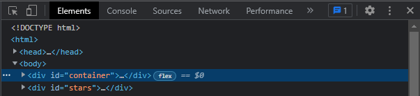
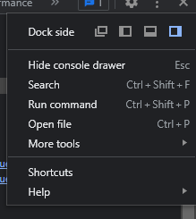
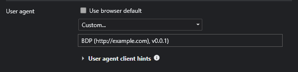

<!-- Prerequisites -->

## 🛠 Prerequisites

⚠️ **UPDATE**: Discord has updated how their servers get requests. Discord only allows requests from their own domains and APIs. In order to use BetterDiscordPanel, you must set a custom User Agent.

Unfortunately, this has to be set every time you open up BetterDiscordPanel. A solution is currently being worked on for this.

### Setting a custom User Agent in Chrome

1. Open Chrome's `developer console`. You can press the Ctrl + Shift + I keys.

2. Click on the icon of the dots in the top right corner.

3. Click on `More tools`, then `Network conditions`.

4. Scroll down to the User agent section and unclick the checkbox labelled `Use browser default`. Make sure the User Agent is set to `Custom`.

5. Enter a custom User Agent string in the textfield.

e.g: `BDP (http://example.com), v0.0.1)`

6. Start using BetterDiscordPanel!